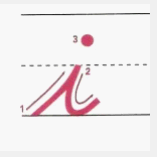
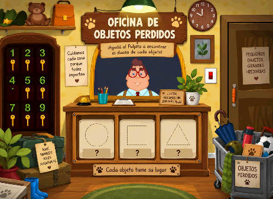
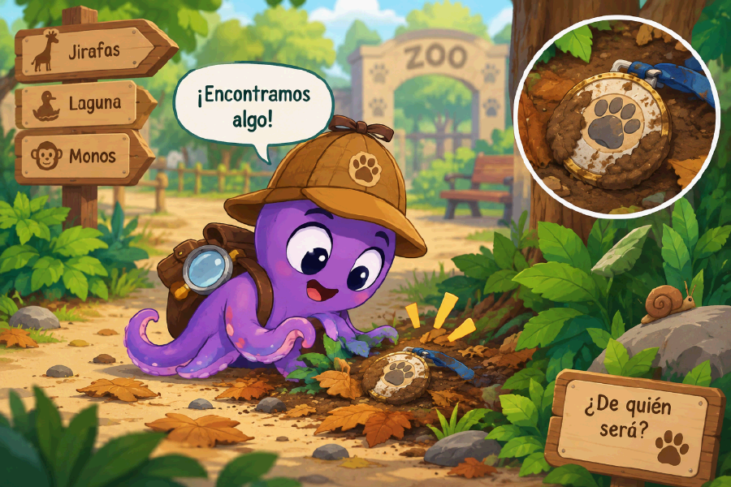
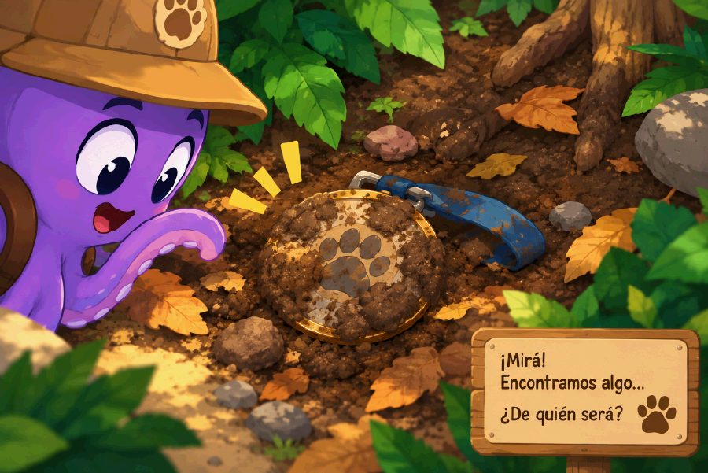
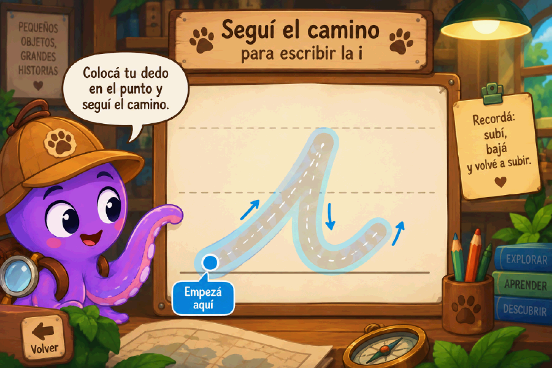
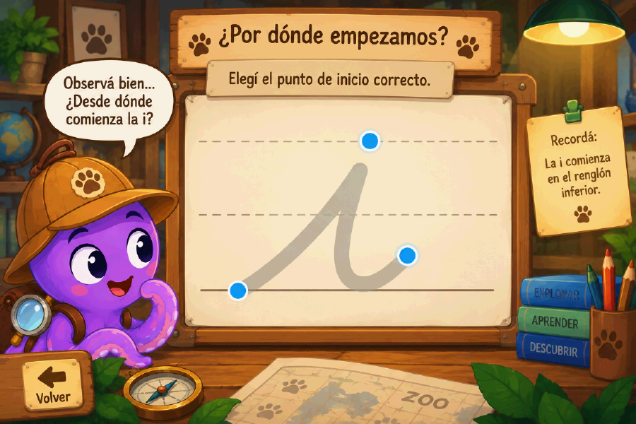
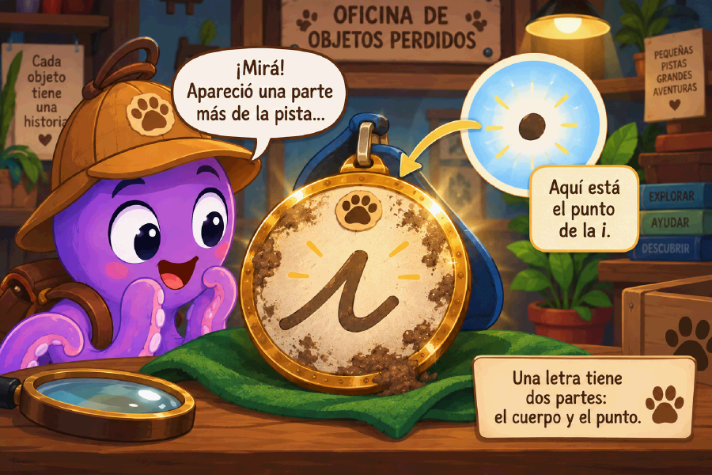
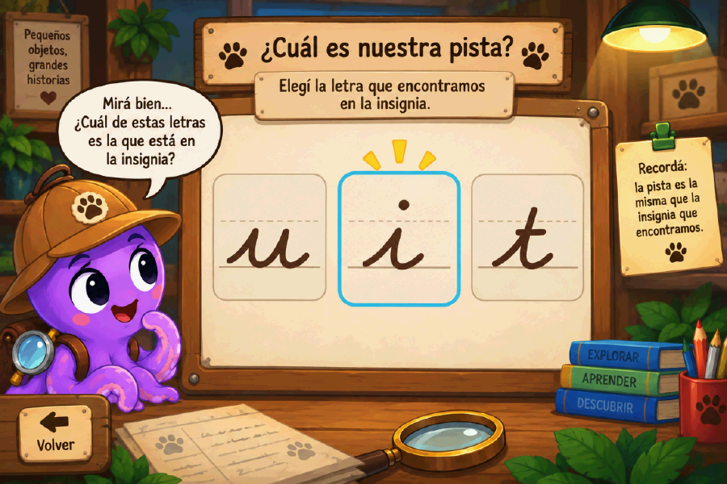

# Primer caso de Objetos Perdidos — la insignia misteriosa (grafía de la `i` cursiva)

Transcripción de `PRIMER CASO DE OBJETOS PERDIDOS.docx.pdf`, recibido el
2026-09-16. Las ilustraciones del documento están en
`docs/referencias/primer-caso/` (arte generado por IA; son referencia de
dirección visual y de layout, no arte final ni assets aprobados).

**Dónde cae en el plan.** Esta es una etapa **posterior** a todo lo que hoy
existe en `main`. Las aventuras por animal (`docs/13`) trabajan movimiento
grafomotor **sin letras**. Este documento abre el capítulo de las **letras
cursivas**, que en la progresión vienen "mucho después". No se implementa
hasta que el prólogo del cuidador (`docs/16`) y las aventuras del zoológico
estén cerradas.

**Estado: documentado, sin implementar. No es el próximo paso.**

---

## Encabezado

- **Letra a trabajar**: `i` minúscula cursiva.
- **Propósito**: iniciar el aprendizaje de la grafía de la primera letra
  cursiva, recuperando movimientos grafomotores previamente ejercitados y
  avanzando desde un trazado altamente asistido hacia una ejecución con menor
  apoyo visual.
- **Modelo gráfico**: el movimiento comienza sobre el renglón inferior,
  asciende hacia la línea media, desciende nuevamente y continúa con el
  movimiento de salida que posteriormente permitirá el enlace con otras
  letras. El punto se incorpora como una acción **posterior** al trazado del
  cuerpo de la letra.

## Situación narrativa

La Oficina de Objetos Perdidos acaba de abrir. Sus casilleros todavía están
vacíos.

Mientras realiza su recorrido habitual por el zoológico, el Pulpito observa
algo que brilla entre unas hojas del sendero. Al acercarse descubre una
insignia cubierta de barro. No sabe a quién pertenece.

El Pulpito guarda el objeto y comienza su primera investigación.

---

## Las once instancias

### Instancia 1 — Encontrar el objeto

El Pulpito recorre uno de los senderos del zoológico. Entre hojas, piedras y
otros elementos se observa parcialmente un objeto brillante. El niño deberá
localizarlo y tocarlo. Al hacerlo, el Pulpito se acerca, aparta las hojas y
encuentra la insignia.

> Pulpito: "¡Encontramos algo! ¿De quién será?"

La insignia pasa a ocupar un lugar visible dentro de la mochila del
detective.

**Habilidad**: exploración y discriminación visual, atención y selección de
un elemento relevante.

### Instancia 2 — Limpiar la insignia

La insignia está cubierta de barro y no permite observar la marca que
contiene. El niño la limpia con movimientos del dedo sobre su superficie.
Esta acción **recupera una experiencia conocida del capítulo anterior**
—limpiar, descubrir, explorar— pero ahora sobre una superficie más pequeña,
que demanda mayor regulación del movimiento.

A medida que desaparece el barro comienza a verse una marca. Es el cuerpo de
una `i` cursiva, pero todavía no tiene su punto.

> Pulpito: "¡Mirá! Tiene una marca. Puede ser una pista."

En esta instancia **todavía no se solicita escribir la letra**.

### Instancia 3 — Observar cómo se realiza la `i`

La insignia se amplía y la marca ocupa el centro de la pantalla. Aparecen las
referencias del renglón necesarias para comprender su ubicación espacial. Un
punto luminoso indica el lugar de inicio.

La aplicación realiza lentamente una demostración:

> inicio en el renglón inferior → ascenso hacia la línea media → descenso →
> movimiento de salida.

El niño primero observa el movimiento completo, sin necesidad de intervenir.

> Pulpito: "Mirá por dónde empieza…"

La animación puede repetirse si el niño lo necesita.

### Instancia 4 — Primer trazado: camino amplio

La `i` se transforma en un camino ancho. Se mantiene visible el renglón, el
punto de inicio, la dirección del movimiento y un recorrido claramente
delimitado.

El niño coloca el dedo en el punto de inicio y recorre el camino. A medida
que avanza, **el recorrido se ilumina detrás de su dedo**, dando respuesta
visual inmediata.

La aplicación acompaña el movimiento sin penalizar fuertemente los desvíos.
Si el niño se aleja significativamente, el avance puede detenerse y
permitirle volver a intentarlo. El objetivo **no es evaluar precisión**, sino
comprender y experimentar la secuencia motriz de la letra.

### Instancia 5 — Segundo trazado: menor ayuda

La `i` vuelve a aparecer con el camino **más estrecho**. El niño conserva
punto de inicio + renglón + dirección + silueta de la letra. Ya no se
reproduce automáticamente toda la animación: debe recuperar el movimiento
observado y realizar `subir → bajar → salida`. Así comienza a anticipar y
organizar el recorrido.

### Instancia 6 — ¿Por dónde empieza?

Antes de volver a escribir, aparece la `i` acompañada por **dos o tres
posibles puntos de inicio**.

> Pulpito: "¿Por dónde empezamos?"

El niño selecciona el punto correcto. Cuando lo encuentra, el punto se
ilumina y comienza la siguiente actividad. Busca que el niño no dependa
únicamente de seguir una línea, sino que **anticipe dónde se inicia** el
movimiento de escritura.

### Instancia 7 — Trazado con menor apoyo

La letra aparece con una guía visual mucho más suave. Se mantienen el renglón
y el punto inicial; el recorrido puede aparecer en tono tenue o mediante
referencias mínimas. La intención es pasar de **seguir un camino** a
**producir una forma gráfica conocida**.

Al finalizar correctamente, el trazo realizado permanece unos segundos en
pantalla. Pero ocurre algo: a la letra le falta el punto.

### Instancia 8 — El punto perdido

> Pulpito: "¡Esperá! Parece que le falta algo…"

Aparece el punto separado del cuerpo de la letra. El niño deberá colocarlo en
el lugar correspondiente, por encima del cuerpo de la `i`. Cuando lo hace, la
letra queda completa.

Esta instancia enseña de manera significativa que **el punto se incorpora
después** de realizar el cuerpo de la letra, en lugar de presentarlo como una
regla verbal que hay que memorizar.

### Instancia 9 — Reconocer la pista

Aparecen algunas grafías diferentes y el niño debe reconocer cuál corresponde
a la marca encontrada en la insignia.

> Pulpito: "¿Cuál es nuestra pista?"

El niño selecciona la `i` cursiva. Así se articula el movimiento realizado
con el **reconocimiento visual** de la grafía.

### Instancia 10 — Resolver el misterio

> **Nota del documento original.** Esta sección está escrita como una
> revisión en voz alta de la autora sobre una versión anterior. Se transcribe
> su contenido, no su forma de borrador. La decisión que toma: **no** agregar
> tres tipos de huellas ni una deducción compleja; recuperar en su lugar la
> memoria del capítulo anterior.

#### 10.1 Primera pista: una huella conocida

Con la insignia limpia y la `i` cursiva ya reconocida, el Pulpito regresa al
lugar donde encontró el objeto. Usa su lupa y observa el suelo con mayor
atención. Entre el barro y las hojas descubre **una huella**.

La huella resulta familiar: es similar a las que el niño encontró y siguió
durante una de las primeras aventuras del capítulo anterior, cuando ayudó al
Pulpito a buscar al pato perdido. La aplicación recupera así una experiencia
ya vivida y invita a relacionar una pista nueva con un conocimiento anterior.

> Pulpito: "¡Esta huella me resulta conocida! ¿Te acordás de quién era?"

Aparecen **tres animales** como alternativas visuales, entre ellos el pato. El
niño observa la huella y selecciona al animal correspondiente. Al tocar el
pato puede aparecer brevemente la huella junto a él, confirmando
visualmente la relación:

> HUELLA → PATO

El Pulpito guarda la nueva pista en su cuaderno de detective:

> "Entonces… tal vez nuestro pato sepa algo."

Y eso da una transición natural a la siguiente pantalla: visitar al pato que
se rescató en el capítulo 1.

**Por qué importa**: el animal anterior **no desaparece de la app** una vez
terminado su nivel. El chico vuelve a encontrarlo, pero ahora tiene otro
papel dentro de la historia. El pato puede incluso **no** ser el dueño de la
insignia: puede ser un **testigo** que vio quién pasó, encontró otra pista o
conduce al Pulpito hacia otro sector.

La cadena queda así:

> `i` cursiva → huella conocida → recordar al pato → visitar al pato → nueva
> pista → dueño de la insignia

Con esto, Objetos Perdidos se siente como una **continuación del mismo
zoológico**, no como un segundo juego pegado al primero.

### Instancia 11 — Regreso a la Oficina de Objetos Perdidos

El Pulpito vuelve a la oficina. El primer casillero, antes vacío, se completa
con una imagen de la insignia recuperada y la `i` cursiva descubierta. Los
otros dos casilleros permanecen cerrados. El niño puede tocar el primer
casillero para volver a observar la letra y su movimiento.

Finalmente aparece una nueva pista en algún lugar del zoológico. Hay otro
objeto perdido. Comienza así el segundo caso.

---

## Progresión pedagógica del primer caso

Este primer caso introduce una lógica que se mantendrá durante el aprendizaje
de las siguientes grafías:

> DESCUBRIR → OBSERVAR → COMPRENDER EL MOVIMIENTO → TRAZAR CON AYUDA →
> REDUCIR LA AYUDA → ANTICIPAR → TRAZAR CON MAYOR AUTONOMÍA → COMPLETAR →
> RECONOCER → UTILIZAR LA LETRA PARA RESOLVER EL CASO

La intención es que el niño no experimente la escritura como una actividad
separada del juego. La grafía constituye una **pista necesaria** para
resolver el misterio, mientras que las ayudas se reducen progresivamente para
favorecer la construcción y posterior automatización del gesto gráfico.

---

## Lectura cruzada contra el código actual (nota de esta transcripción)

No es parte del documento original. Sirve para saber qué de esto ya tiene
motor y qué no.

| Instancia | Mecánica | ¿Existe hoy? |
|---|---|---|
| 1 | Tocar un objeto oculto en una escena | No. Hay `hit`-testing de sectores en `ZooMap`, no de objetos dentro de una escena |
| 2 | Limpiar una superficie chica con el dedo | **Sí, el motor existe**: grilla de revelado (`levels/revealGrid.ts`, `canvas/RevealLayer.tsx`). Falta la variante de superficie pequeña |
| 3 | Demo animada del trazo | **Sí, parcialmente**: el motor de niveles tiene `demo` |
| 4, 5, 7 | Corredor que se ilumina, con ancho decreciente | **Sí**: es exactamente el corredor del motor, con `tolerance` decreciente y retiro de guía (`screen/guideWithdrawal`) |
| 6 | Elegir el punto de inicio entre candidatos | No |
| 8 | Arrastrar el punto a su lugar | **Sí, el motor existe**: arrastre de objetos del paso E (víboras) |
| 9 | Elegir una grafía entre tres | **Sí**: `screen/Deduction.tsx` es esta pantalla con otra semántica |
| 10.1 | Elegir el animal dueño de la huella | **Sí**: `Deduction` + `detective/cases.ts`, hoy en pausa |
| 11 | Oficina con casilleros que se llenan | No. Es la home de `docs/10`, reemplazada por el mapa (`docs/12`). Vuelve acá como **pantalla de capítulo**, no como home |

La letra `i` ya tiene glifo: `client/src/letters/svg/i.svg`. El registro de
letras (`letters/registry.ts`) y la validación por checkpoints existen del
MVP original, antes de que la app girara al zoológico.
